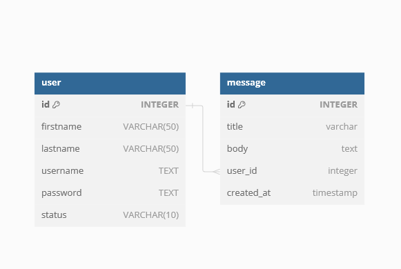

# MemberOnly Web App
This is the Member Only project to create a simple CRUD app with Typescript, Node, Express, PostgreSQL and authentication with passport.js local startegy. <br>
**Demo**: :point_right:[**Click here**](https://memberonlyts.onrender.com/):point_left:. <br>
Please allow up to 1 minutes for the website to load.
## Install and set up
Follow these step below to set up the website in your local machine.

### Prerequisites:
Ensure [Node](https://nodejs.org/en) and [npm](https://www.npmjs.comnode) are installed in your computer.
### Steps:
1. Clone the repo: <br>
```bash
git clone https://github.com/YourUserName/memberOnlyTS
```
2. Navigate to the project folder:<br>
```bash
cd memberOnlyTS
```
3. Install the dependencies:<br>
```bash
npm install
```
4. Create the .env file:<br>
```bash
touch .env
```
5. Add your environment inside the file: <br>
```bash
DB_HOST=
DB_PORT=
DB_USER=
DB_PASSWORD=
DB_NAME=
PORT=
FOO_COOKIE_SECRET=
```
6. Start the dev server:<br>
```bash
npm run dev
```

After these step, you should browser and navigate to `http://localhost:3000` to view the application in action.
## Production:

To prepare the project for production deployment, please use the following command: <br>
```bash
npm start
```
## Tech stack:
+ [Node](https://nodejs.org/en) as runtime environment. <br>
+ [Pug](https://pugjs.org/api/getting-started.html) as server-side template rendering. <br>
+ [Express](https://expressjs.com/) as backend framework. <br>
+ [PostgreSQL](https://www.postgresql.org/) SQL database for storing inventory information. <br>
+ [Typescript](https://www.postgresql.org/) strongly-typed language for building robust and scalable applications. <br>
+ [Passport](https://www.passportjs.org/)authentication middleware for managing user authentication and session handling in Node applications. <br>

Database design: 
